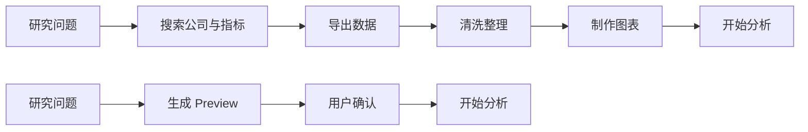
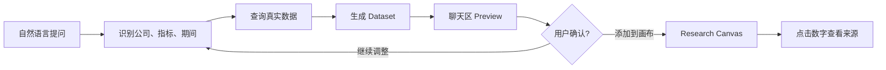
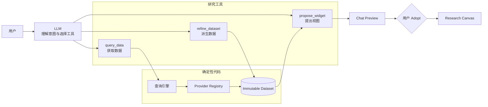
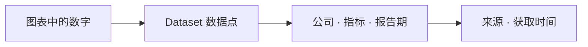

<p align="center">
  
</p>

<h1 align="center">Research Canvas</h1>

<p align="center">
  <strong>把研究问题直接变成可验证的数据看板</strong><br/>
  AI 投研 Agent · 交互式数据画布 · 自托管
</p>

<p align="center">
  <a href="#核心体验">核心体验</a> ·
  <a href="#为什么这样设计">产品决策</a> ·
  <a href="#ai-native-架构">AI Native</a> ·
  <a href="#本地运行">本地运行</a> ·
  <a href="docs/SELF-HOSTING.md">部署</a>
</p>

---

## 一句话说明

Research Canvas 面向需要快速完成公司财务比较的研究者。用户用自然语言提出问题，系统取回真实数据、生成图表预览；用户确认后，图表才进入右侧画布。

| 真实数据 | 用户控制 | 数字可追溯 |
|---|---|---|
| 模型不编财务数字 | Preview 后由用户 Adopt | 点击数值查看公司、指标、报告期与来源 |

<p align="center">
  
</p>

## 为什么做

研究者真正想做的是观察数据、比较差异、形成判断。传统流程中，大量时间消耗在数据准备上。



第一阶段只解决一个任务：

> 上市公司标准财务指标的横向与时间序列比较。

不做选股推荐，不替用户形成投资结论。

## 核心体验

以“对比贵州茅台和五粮液 2019–2024 年净资产收益率”为例：



[可编辑流程图源文件](docs/diagrams/research-canvas-core-flow.drawio)

| 1. 先预览 | 2. 再组织 | 3. 随时核验 |
|---|---|---|
|  |  |  |
| 数据范围、图形与完整性先在聊天区确认 | 一个会话对应一块活看板，可拖动、缩放、切换视图 | 查看公司、指标、报告期、来源和获取时间 |

### 多轮调整

| 用户说 | 系统做 |
|---|---|
| “去掉五粮液” | 派生新 Dataset，原数据不被覆盖 |
| “只看 2022–2024” | 本地收窄期间，不重复请求已有数据 |
| “改成排名” | 复用同一 Dataset，只改变视图 |
| “再看 ROE” | 发起新查询，生成新 Dataset |
| “把右边这张图改掉” | 只在用户明确指向已有图时更新画布 |

## 为什么这样设计

| 产品问题 | 选择 | 代价 |
|---|---|---|
| AI 是否直接修改画布 | Preview → Adopt | 多一次确认，换来可控性 |
| 什么任务需要先确认 | ≤3 家明确公司直接查；大样本或行业任务先确认 | 复杂任务更慢，但范围更清楚 |
| 修改图表是否重新取数 | 数据与视图分离 | 需要维护 Dataset 与 Widget 两套对象 |
| 数据范围变化怎么保存 | 生成新 Dataset 并记录父子关系 | 存储更多版本，保留可复现性 |
| 真实数据失败怎么办 | 明确失败，不回退 Mock | 少一个“看起来成功”的结果 |
| 是否同时做研报、脑图、网页 | 默认关闭，用户按需开启 | 功能入口更克制，主路径更稳定 |

产品北极星：

> 让用户更快进入判断，而不是让 AI 替用户判断。

## AI Native 架构

模型负责理解和选择，代码负责数据和计算，用户负责最终采纳。



[可编辑架构图源文件](docs/diagrams/research-canvas-ai-native.drawio)

| 主体 | 决定什么 | 不做什么 |
|---|---|---|
| LLM | 查什么、如何理解上下文、推荐哪种视图 | 不生成或计算财务数字 |
| 确定性代码 | 取数、标准化、计算、完整性校验、渲染 | 不替用户决定研究结论 |
| 用户 | 是否采纳、如何组织、最终交付什么 | 不需要手工拼装底层查询 |

### 数据流

```text
UI → Agent Tools → Research Hub → Market Data Engine → Provider
                                      ↓
                              Immutable Dataset
                                      ↓
                              Preview → Adopt
```

完整分层见 [架构文档](docs/ARCHITECTURE.md)。

## 可信机制



| 风险 | 系统规则 |
|---|---|
| 缺失值被误当成 0 | `null ≠ 0`，界面显示“—” |
| 模型编造数字 | 数字必须来自 Provider 返回结果 |
| 多轮修改覆盖原数据 | 数据语义变化生成新 Dataset |
| AI 越权修改画布 | `propose_widget` 只生成 Preview |
| 真实接口失败后展示假数据 | Fail closed，不静默使用 Mock |
| 数据范围过大或含义模糊 | 先展示计划，用户确认后查询 |

### 评测方向

| 任务质量 | 数据可信 | 产品体验 | 系统质量 |
|---|---|---|---|
| 任务完成率 | 数字证据覆盖率 | Preview 采纳率 | 延迟与失败率 |
| 工具选择正确率 | 确定性重算一致率 | 澄清与误拒率 | 数据源可用率 |

这些是评测框架，不是尚未测量的成绩。阶段验收和已记录的测试结果见 [HANDOFF](Research%20Canvas/HANDOFF.md#验收4b浏览器-golden-path2026-09-10)。

## 产品能力

| 能力 | 当前状态 |
|---|---|
| 对话式研究 | 流式中文交互；按任务调用数据与画布工具 |
| Research Canvas | 一个会话一块看板；支持拖动、缩放、整理布局 |
| 图表 | 折线、柱状、排名、热力表、堆积、柱线、饼图、K 线、表格 |
| 数据调整 | 增减公司、收窄期间、切换指标、复用视图 |
| 数字溯源 | 图表点、柱、表格单元格均可查看来源 |
| 交付 | 演示模式、16:9 / 9:16 图片、本机只读快照 |
| 多市场 | A 股、美股、港股等，经统一查询层接入 |
| 报告与脑图 | 默认关闭；在输入框“+”菜单按需开启 |
| 部署 | Docker Compose 或裸 Node 自托管 |

## 版本演进

| 阶段 | 解决的问题 |
|---|---|
| Phase 1–2 | 收敛工作区，建立静态 Canvas |
| Phase 3 | Agent 可以操作结构化 Widget |
| Phase 4A | 接入真实财务数据 |
| Phase 4A.1 | 建立 Preview → Adopt 控制边界 |
| Phase 4B | Dataset 不可变与多轮派生 |
| Phase 4C | 交互性能、视图推荐、流式体验与品牌收敛 |
| C 端 P0–P4 | 会话看板、单元格溯源、分级确认、演示导出、只读快照 |

当前交付范围与未开始事项以 [HANDOFF](Research%20Canvas/HANDOFF.md) 为准。

## 本地运行

### 环境

- Node.js 24+
- 大模型 API Key：OpenAI 兼容接口或本地推理
- 财务数据源凭证：在应用“设置 → 数据源”配置

### 启动

```bash
cp .env.example .env
npm install
npm run build:packages
```

开发模式：

```bash
# 终端 1
npm run start

# 终端 2
WEB_HTTPS=0 npm run dev
```

打开 `http://127.0.0.1:5173`，创建新对话并输入：

```text
对比贵州茅台和五粮液 2019 到 2024 年净资产收益率
```

预览生成后点击“添加到画布”，再点击折线上的年份查看来源。

### 自动演示

```bash
npx playwright install chromium
npm run test:e2e:smoke
```

脚本会执行 90 秒主路径，并更新 `docs/images/` 中的预览、画布、溯源和 16:9 封面。

## 自托管

```bash
cp compose.env.example compose.env
docker compose up -d --build
```

默认入口：`https://<主机>:8712`。

| 方式 | 适合场景 | 限制 |
|---|---|---|
| 只读看板 | 发送给访客查看 | 只在当前部署有效，不消耗模型或数据配额 |
| 演示用户 | 现场体验完整流程 | 每次提问消耗模型和数据源配额 |
| 本地开发 | 产品迭代与调试 | 默认不对公网开放 |

公网开放前必须完成账户认领并配置演示用户。完整步骤见 [自托管文档](docs/SELF-HOSTING.md)。

## 当前边界

| 已完成 | 尚未进入当前范围 |
|---|---|
| 公司财务比较与时间序列 | 完整 Inspector / Notes |
| 多轮调整与视图切换 | Multi-select |
| 演示、图片导出、本机快照 | Excel Export |
| 标准行情与财务数据 | 完整行业指标工作流 |

- “发布”是当前部署上的只读快照，不是公网 SaaS 分享服务。
- 数据能力取决于配置的数据源与其覆盖范围。
- Research Canvas 用于数据查询与研究整理，不提供证券投资建议或自动交易。

## 项目文档

| 文档 | 内容 |
|---|---|
| [HANDOFF](Research%20Canvas/HANDOFF.md) | 当前阶段、验收记录、已知问题 |
| [PRD](Research%20Canvas/PRD.md) | 产品目标、用户故事、MVP 边界 |
| [ARCHITECTURE](docs/ARCHITECTURE.md) | 当前系统分层与真实代码落点 |
| [DATA-LAYER](docs/DATA-LAYER.md) | 数据驱动、缓存与 Provider 结构 |
| [AGENT-GUIDE](docs/AGENT-GUIDE.md) | Agent 工具、能力包与使用边界 |
| [SELF-HOSTING](docs/SELF-HOSTING.md) | Docker、云服务器和安全配置 |
| [REPO-LAYOUT](docs/REPO-LAYOUT.md) | 仓库目录地图 |
| [CONTRIBUTING](CONTRIBUTING.md) | 开发与贡献方式 |

## License

[Apache License 2.0](LICENSE)
