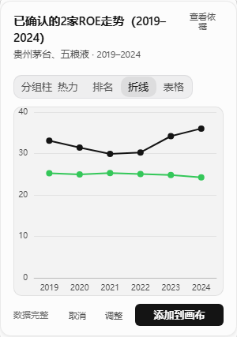
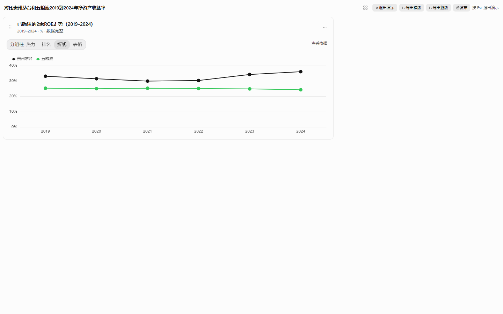
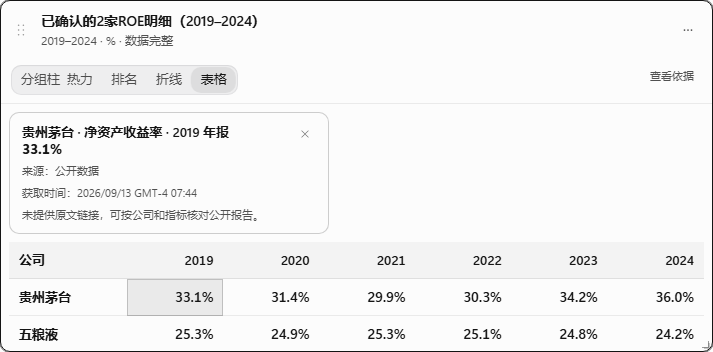

<p align="center">
  
</p>

# Research Canvas

<p align="center">
  <strong>AI 投研 Agent · 交互式数据分析画布</strong><br/>
  对话提问 → 取数 → 预览图表 → 采纳到画布 · 自托管 · 多市场数据
</p>

<p align="center">
  <a href="docs/SELF-HOSTING.md">自托管部署</a> ·
  <a href="docs/ARCHITECTURE.md">架构</a> ·
  <a href="LICENSE">Apache-2.0</a>
</p>

---

## 产品形态

```text
左侧 Chat Agent          右侧 Research Canvas
提问 / 调整 / 确认              组织图表 · 导出 · 交付
```

日常研究路径：提问 → 真实财务数据 → 聊天区预览 → 你点「添加到画布」。点名不超过 3 家公司会直接取数；超过 3 家或按行业对比时，会先给出取数计划，确认后再查。

点图表上的数字，可以看到公司、指标、报告期和来源。演示模式适合录屏；导出横版 / 竖版图可带走。**发布**生成的是当前这台自托管实例上的只读快照，不是公网分享服务，链接离开本机部署打不开。

<p align="center">
  
  
  
</p>

需要**网页报告、一页式 TSX 报告或结构脑图**时，在输入框 **+ → 报告与脑图** 打开后再提问；默认关闭，以免与右侧研究画布混淆。

---

## 核心能力

| 能力 | 说明 |
|------|------|
| **对话 Agent** | 流式中文投研对话；按意图挂载工具包 |
| **Research Canvas** | 每个对话一块活看板；点数字看来源；可演示、导出图、生成本机只读快照 |
| **报告与脑图（可选）** | 输入框 + 菜单勾选后启用网页报告 / TSX 画布 / 脑图；与右侧研究画布分离 |
| **多市场数据** | A 股 / 美股 / 港股等；经统一查询层接入 |
| **自托管** | Docker Compose 或裸 Node + 反向代理；数据留在本机 |

> **2026-09 产品收敛**：已移除量化评分/回测、Discover 挖掘、Experts 市场、行情终端右栏与 crypto 内置源；主路径为对话 + 研究画布 + 基本面/资讯/机构研报。详见 [docs/ARCHITECTURE.md](docs/ARCHITECTURE.md)。

---

## 快速开始

> 需要自备大模型 API Key（OpenAI 兼容或本地推理），以及财报数据源凭证（在应用「设置 → 数据源」中填写）。

### 第一次运行

1. 复制环境变量模板并填入模型密钥：

```bash
cp .env.example .env
```

至少填写 `LLM_API_KEY`（以及如需修改的 `LLM_BASE_URL` / `LLM_MODEL`）。不要把填好的 `.env` 提交进仓库。

2. 安装并启动：

```bash
npm install
npm run build:packages
```

推荐开发（HTTP，避免自签名证书拦浏览器）：

```bash
# 终端 1
npm run start

# 终端 2
WEB_HTTPS=0 npm run dev
```

浏览器打开 [http://127.0.0.1:5173](http://127.0.0.1:5173)。也可只跑 `npm run dev`（默认 HTTPS 自签名）。

3. 打开 **设置 → 数据源**，配置财报接口后保存。

4. 点顶栏标题 → **新建对话**，发送：

```text
对比贵州茅台和五粮液2019到2024年净资产收益率
```

预览出图后点「添加到画布」。再点折线上的某一年，应出现「公司 · 净资产收益率 · 某某年报 · 来源」。

演示 90 秒脚本与封面导出也可自动跑（需本机服务已启动）：

```bash
npx playwright install chromium
npm run test:e2e:smoke
```

截图与 16:9 封面写入 [docs/images/](docs/images/preview.png)。

### Docker 自托管

详见 **[docs/SELF-HOSTING.md](docs/SELF-HOSTING.md)**。

```bash
docker compose up -d
```

---

## 文档

| 文档 | 说明 |
|------|------|
| [docs/README.md](docs/README.md) | 文档索引 |
| [docs/SELF-HOSTING.md](docs/SELF-HOSTING.md) | 部署、升级、环境变量 |
| [docs/ARCHITECTURE.md](docs/ARCHITECTURE.md) | 分层与数据流（含代码写实） |
| [docs/DATA-LAYER.md](docs/DATA-LAYER.md) | 行情能力与 Provider 落点 |
| [docs/AGENT-GUIDE.md](docs/AGENT-GUIDE.md) | Agent 工具与技能 |
| [docs/REPO-LAYOUT.md](docs/REPO-LAYOUT.md) | 根目录地图 |
| [Research Canvas/HANDOFF.md](Research%20Canvas/HANDOFF.md) | 阶段进度、验收与代码地图 |
| [packages/README.md](packages/README.md) | 内部包清单 |
| [CONTRIBUTING.md](CONTRIBUTING.md) | 如何贡献 |

---

## 合规说明

Research Canvas 是**数据查询与投研整理工具**，用于聚合公开或授权数据源、辅助阅读与分析。**不是**证券投顾软件，**不提供**代客理财或自动下单。请独立核实信息并自行决策。

---

## 许可

[Apache License 2.0](LICENSE)
