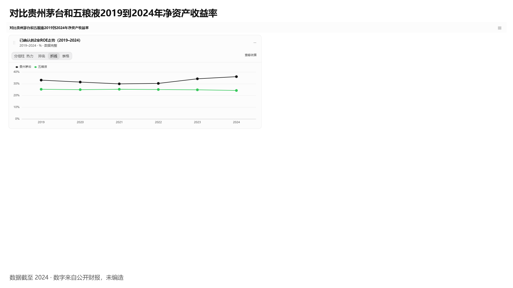
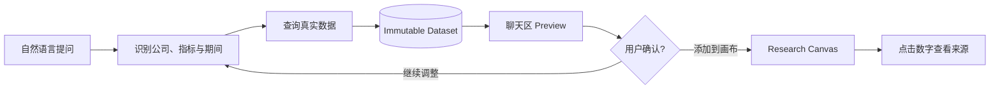
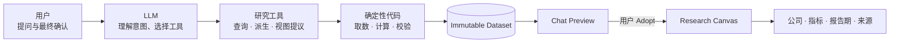
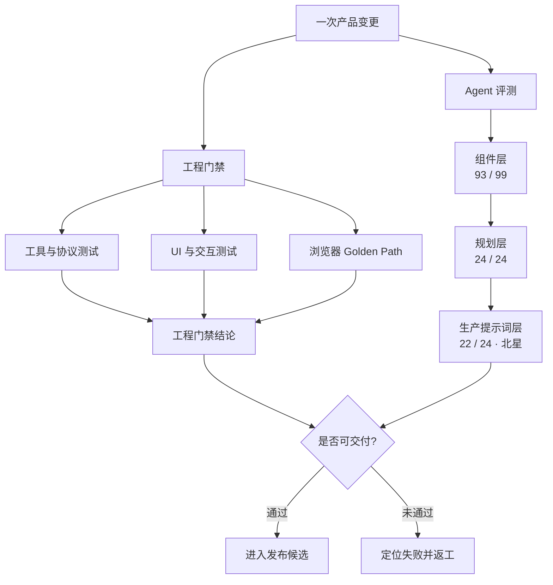

<p align="center">
  
</p>

<h1 align="center">Research Canvas</h1>

<p align="center">
  <strong>把研究问题变成每个数字都能追溯来源的数据看板</strong><br/>
  AI 投研 Agent · 交互式数据画布 · Preview → Adopt · 自托管
</p>

<p align="center">
  <a href="#产品工作流">产品工作流</a> ·
  <a href="#三个核心差异">核心差异</a> ·
  <a href="#ai-native-产品架构">产品架构</a> ·
  <a href="#评测体系">评测体系</a> ·
  <a href="#快速开始">快速开始</a> ·
  <a href="docs/SELF-HOSTING.md">自托管</a>
</p>

> **当前状态：** 可自托管的产品演示版本。主路径已跑通公司财务比较、多轮调整、Preview → Adopt 和数值溯源；完整行业工作流等能力仍在建设中。

---

## 先看产品

<p align="center">
  <a href="docs/media/research-canvas-demo.mp4?raw=1">
    
  </a>
</p>

<p align="center">
  <strong>▶ 点击封面播放完整演示（03:31）</strong><br/>
  自然语言提问 → 数据预览 → 添加到画布 → 点击数字查看来源
</p>

## 为什么需要 Research Canvas

研究者真正需要的是观察数据、比较差异并形成判断，但传统流程往往把大量时间消耗在搜索、导出、清洗和制图上。

通用 AI 助手虽然可以快速回答问题，却很难同时保证三件事：数字来自真实数据、每个数字都能核验、AI 不会擅自改变用户的研究成果。

Research Canvas 聚焦一个明确任务：

> 将上市公司标准财务指标的横向与时间序列比较，转化为可验证、可调整、可复用的研究画布。

它不做选股推荐，不替用户形成投资结论。

## 三个核心差异

| 真实数据 | 用户控制 | 数字可追溯 |
|---|---|---|
| 财务数字由代码向数据源查询和计算，模型不手编数字 | 图表先在聊天区 Preview，只有用户 Adopt 后才进入画布 | 点击图表或表格中的数值，可查看公司、指标、报告期、来源与获取时间 |

1. **模型做选择，代码做计算：** 模型理解研究意图并推荐视图；确定性代码负责取数、计算和完整性校验。
2. **Preview → Adopt：** AI 可以提出图表，但不能替用户修改研究画布。
3. **数值 → Dataset → 来源：** 数据变化生成新 Dataset，视图变化复用原 Dataset，研究过程可以回看和复现。

## 产品工作流



[打开可编辑的产品工作流源文件](docs/diagrams/research-canvas-core-flow.drawio)

| 1. 先预览 | 2. 再组织 | 3. 随时核验 |
|---|---|---|
|  |  |  |
| 确认数据范围、图形和完整性 | 拖动、缩放并切换视图 | 查看公司、指标、报告期和来源 |

### 多轮调整不会破坏原始研究

| 用户指令 | 系统行为 |
|---|---|
| “去掉五粮液” | 派生新 Dataset，保留原数据 |
| “只看 2022–2024” | 本地收窄期间，不重复请求已有数据 |
| “改成排名” | 复用同一 Dataset，只改变视图 |
| “再看 ROE” | 发起新查询，生成新 Dataset |
| “把右边这张图改掉” | 仅在用户明确指向已有图时更新画布 |

## 关键产品决策

| 产品问题 | 当前选择 | 主动承担的代价 |
|---|---|---|
| AI 是否直接修改画布 | Preview → Adopt | 多一次确认，换取清晰控制权 |
| 修改图表是否重新取数 | 数据与视图分离 | 同时维护 Dataset 与 Widget |
| 数据范围变化如何保存 | 派生新 Dataset 并记录父子关系 | 增加存储，保留可复现性 |
| 真实数据失败怎么办 | Fail closed，不回退 Mock | 宁可明确失败，也不展示假成功 |
| 是否同时做研报、脑图和网页 | 默认关闭，用户按需开启 | 功能入口更克制，研究主路径更稳定 |

> 产品北极星：让用户更快进入判断，而不是让 AI 替用户判断。

## AI Native 产品架构



[打开可编辑的产品架构源文件](docs/diagrams/research-canvas-ai-native.drawio)

| 主体 | 负责 | 明确不负责 |
|---|---|---|
| LLM | 理解上下文、决定查什么、推荐哪种视图 | 不生成或计算财务数字 |
| 确定性代码 | 取数、标准化、计算、完整性校验和渲染 | 不替用户形成投资结论 |
| 用户 | 决定是否采纳、如何组织、最终交付什么 | 不需要手工拼装底层查询 |

## 评测体系

Research Canvas 不用一个模糊的“AI 得分”代替质量判断。工程可靠性与 Agent 行为分轨验证，并明确区分已经运行的结果、评测框架和尚未建设的能力。



[打开可编辑的评测体系源文件](docs/diagrams/research-canvas-evaluation-system.drawio)

- Agent 评测与产品工程门禁相互独立，不加权合成一个总分。
- 生产提示词层是当前 Agent 轨道的北星；规划层满分表示量具已校准，不代表产品整体满分。
- 图中结果来自特定版本和夹具，不是长期 KPI；真实数据数值层评测仍未建设，因此不宣称数据源本身“零错误”。

完整评测说明见 [Agent Eval](docs/AGENT-EVAL.md)。

## 当前能力与边界

| 已完成 | 尚未进入当前范围 |
|---|---|
| 公司财务比较与时间序列 | 完整行业指标工作流 |
| 多轮调整与视图切换 | Inspector / Notes / Multi-select |
| 图表和表格的单点数值溯源 | Excel Export |
| 演示、图片导出和本机只读快照 | 公网 SaaS 分享服务 |
| A 股、美股、港股等统一查询层 | 投资建议或自动交易 |

当前支持折线、柱状、排名、热力表、堆积、柱线、饼图、K 线和表格；实际数据能力取决于配置的数据源及其覆盖范围。

## 快速开始

### 环境要求

- Node.js 24+
- OpenAI 兼容的大模型接口或本地推理服务
- 在应用“设置 → 数据源”中配置财务数据源凭证

### 本地开发

```bash
cp .env.example .env
npm install
npm run build:packages
```

分别启动服务端和前端：

```bash
# 终端 1
npm run start

# 终端 2
WEB_HTTPS=0 npm run dev
```

打开 `http://127.0.0.1:5173`，创建新对话并输入：

```text
对比贵州茅台和五粮液 2019 到 2024 年净资产收益率
```

预览生成后点击“添加到画布”，再点击折线上的年份查看来源。

### Docker 自托管

```bash
cp compose.env.example compose.env
docker compose up -d --build
```

默认入口：`https://<主机>:8712`。公网开放前需完成账户认领并配置演示用户，详见 [自托管文档](docs/SELF-HOSTING.md)。

## 项目文档

| 文档 | 内容 |
|---|---|
| [HANDOFF](Research%20Canvas/HANDOFF.md) | 当前阶段、验收记录和已知问题 |
| [PRD](Research%20Canvas/PRD.md) | 产品目标、用户故事和 MVP 边界 |
| [ARCHITECTURE](docs/ARCHITECTURE.md) | 系统分层与真实代码落点 |
| [AGENT-EVAL](docs/AGENT-EVAL.md) | Agent 评测分层、夹具和结果解释 |
| [DATA-LAYER](docs/DATA-LAYER.md) | 数据驱动、缓存与数据源结构 |
| [AGENT-GUIDE](docs/AGENT-GUIDE.md) | Agent 工具、能力包与使用边界 |
| [SELF-HOSTING](docs/SELF-HOSTING.md) | Docker、云服务器和安全配置 |
| [CONTRIBUTING](CONTRIBUTING.md) | 开发与贡献方式 |

## License

[Apache License 2.0](LICENSE)
